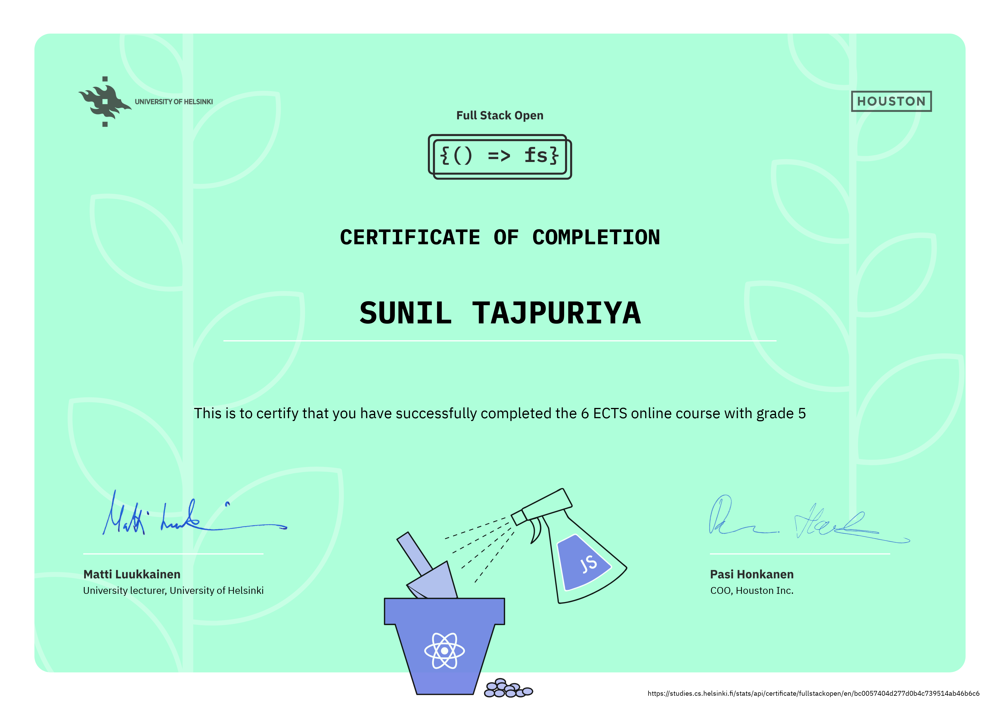

# FullStackOpen Exercises:

[Click here](https://fullstackopen.com/en) to view the main course.  
[Click here](https://studies.cs.helsinki.fi/stats/courses/fullstackopen) to submit the completed part.

## Certification



## Instructions while submitting exercise:

- Each part has its own directory, which contains a directory for each exercise set (like the unicafe exercises in part 1).

- The exercises are submitted one part at a time. When you have submitted the exercises for a part, you can no longer submit any missed exercises for that part.

### Naming convention I used while submitting exercise:

```
part0
part1
    courseinfo
    unicafe
    anecdotes
part2
    courseinfo
    phonebook
    countries
```

## Note Taking:

### Part0

- Learned about traditional website where all the components renders whenever single component is changed.
- AJAX (Asynchronous JavaScript and XML) is a term introduced in February 2005 on the back of advancements in browser technology to describe a new revolutionary approach that enabled the fetching of content to web pages using JavaScript included within the HTML, without the need to re-render the page.
- A single-page application (SPA) is a web application or website that interacts with the user by dynamically rewriting the current web page with new data from the web server, instead of the traditional method of loading entire new pages. This creates a faster and more seamless user experience, similar to that of a native app.

  - Initial Load: When you first open an SPA, all the necessary HTML, CSS, and JavaScript code is loaded by the browser. This usually includes the basic framework of the application, such as the header, navigation bar, and any other static elements.

  - Dynamic Updates: As you interact with the SPA, clicking on links, buttons, or other elements, the JavaScript code makes requests to the web server for new data. This data is then used to update the current page without having to reload the entire thing.

- **JS Libraries**
  - _jQuery:_
    - Developed for enhancing server-generated HTML pages with JavaScript.
    - Successful due to cross-browser compatibility.
    - Less relevant with browser improvements and modern frameworks.
  - _BackboneJS:_
    - Early popular framework, but limited popularity.
  - _AngularJS:_
    - Dominant framework, developed by Google, lost popularity due to backwards compatibility break i.e. AngularJS v2 is not backward compatible with v1.
  - _React (with Redux):_
    - Current leader for browser-side logic, used in this course.
  - _VueJS_
    - emerging as a challenger.

> The world of web development frameworks is constantly evolving.  
> Vanilla(pure) JS concept is always used while working with JS.

---

### Part 1
