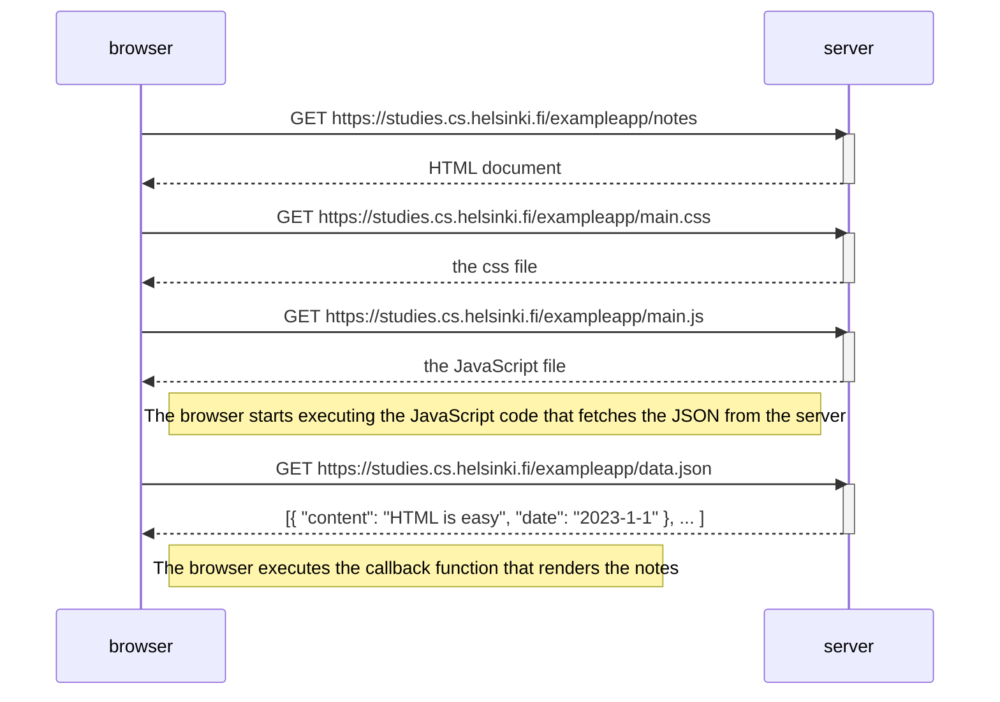
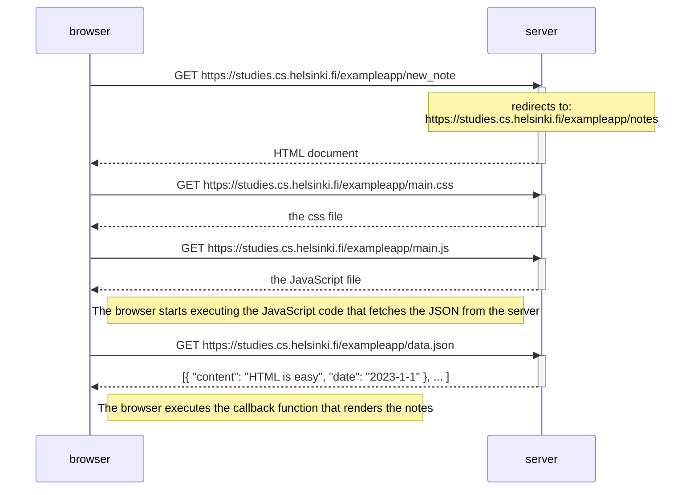

## 0.4 New note diagram

**<u>UNDERSTANDING QUESTION</u>**

**Sequence diagram** depicting the situation where user visits the page: https://studies.cs.helsinki.fi/exampleapp/notes

Here, I have to create a sequence diagram depicting the situation where the user creates a new note on the page https://studies.cs.helsinki.fi/exampleapp/notes by writing something into the text field and clicking the submit button.

I don't have to take an account of all rules while making [sequence diagram](https://www.geeksforgeeks.org/unified-modeling-language-uml-sequence-diagrams/). Sensible way of presenting the events is fine and comments on diagram is a plus point.

**<u>Solution:</u>**

> The sequence diagram below shows the events when user click on `save` button. Below figure doesnot includes the events user entering into the site https://studies.cs.helsinki.fi/exampleapp/notes

