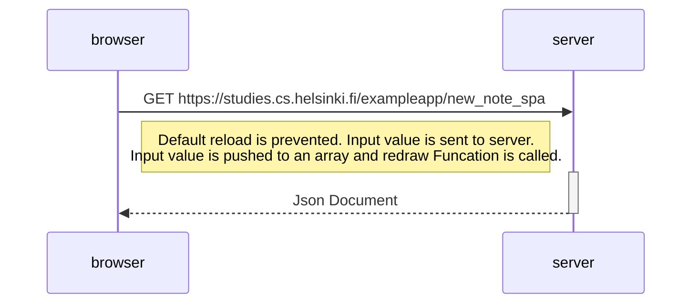

## 0.6: New note in Single page app diagram

Here, I have to create a diagram depicting the situation where the user creates a new note using the single-page version of the app.

> The sequence diagram below shows the events when user click on `save` button. Below figure doesnot includes the events user entering into the site - https://studies.cs.helsinki.fi/exampleapp/spa

