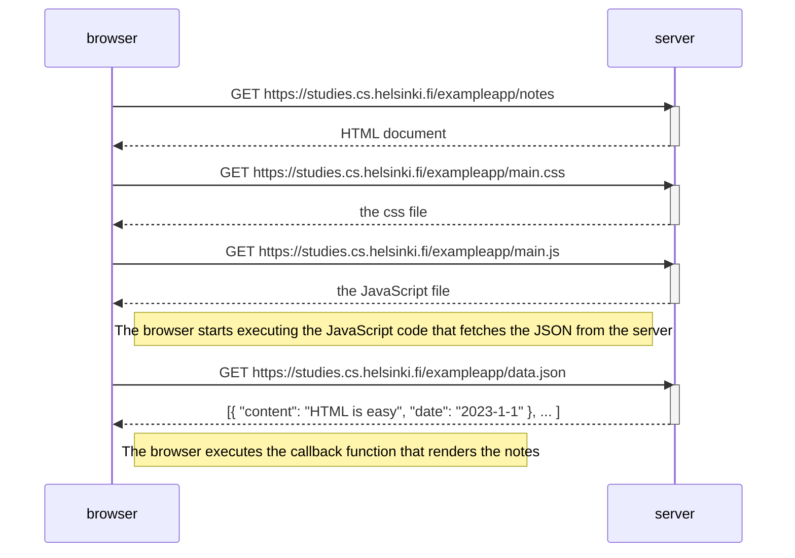
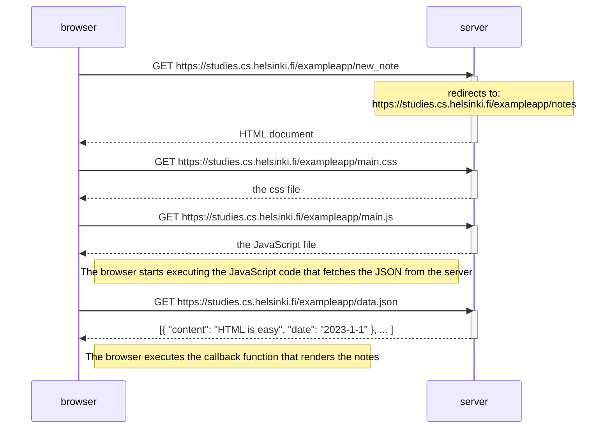
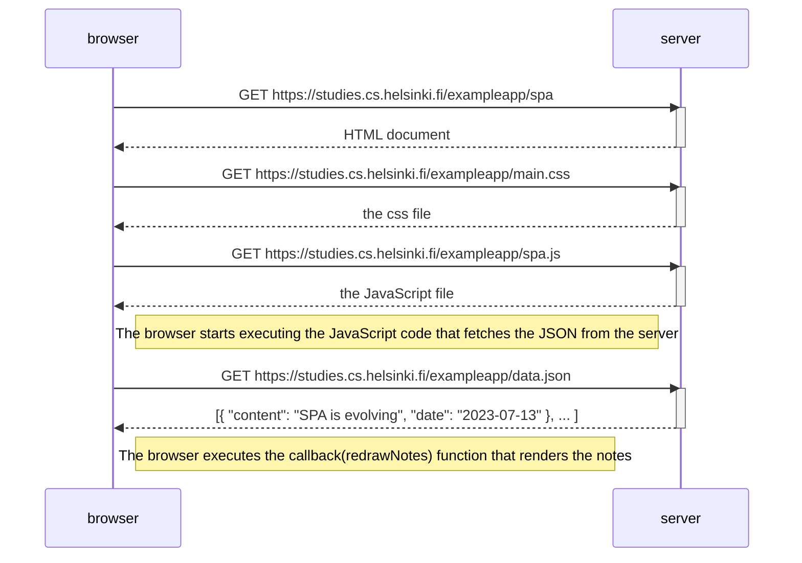
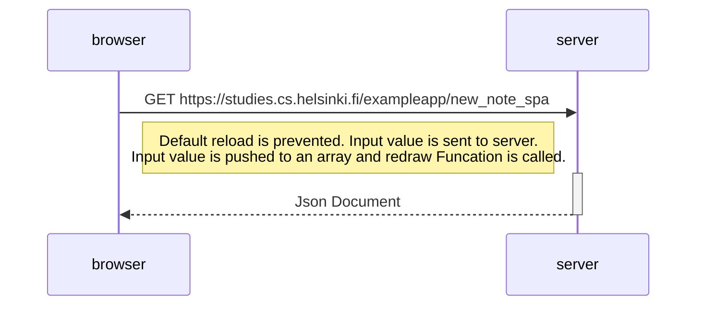

# Exercise of Part0

Part0 has 6 exercises _(0.1-0.6)_. Out of which, first 3 exercise comprise of reading via Mozilla documentation and building basic foundation of web technologies.

## 0.1: HTML

This exercise is not submitted to GitHub. It instruct me to read the [HTML tutorial](https://developer.mozilla.org/en-US/docs/Learn/Getting_started_with_the_web/HTML_basics) from Mozilla.

## 0.2: CSS

This exercise is not submitted to GitHub. It instruct me to read the [CSS tutorial](https://developer.mozilla.org/en-US/docs/Learn/Getting_started_with_the_web/CSS_basics) from Mozilla.

## 0.3: HTML forms

This exercise is not submitted to GitHub. It instruct me to read the [Your-First-Form tutorial](https://developer.mozilla.org/en-US/docs/Learn/HTML/Forms/Your_first_HTML_form) from Mozilla.

## 0.4 New note diagram

**<u>UNDERSTANDING QUESTION</u>**

**Sequence diagram** depicting the situation where user visits the page: https://studies.cs.helsinki.fi/exampleapp/notes

Here, I have to create a sequence diagram depicting the situation where the user creates a new note on the page https://studies.cs.helsinki.fi/exampleapp/notes by writing something into the text field and clicking the submit button.

I don't have to take an account of all rules while making [sequence diagram](https://www.geeksforgeeks.org/unified-modeling-language-uml-sequence-diagrams/). Sensible way of presenting the events is fine and comments on diagram is a plus point.

**<u>Solution:</u>**

> The sequence diagram below shows the events when user click on `save` button. Below figure doesnot includes the events user entering into the site https://studies.cs.helsinki.fi/exampleapp/notes

## 0.5: Single page app diagram

Here, I have to create a diagram depicting the situation where the user goes to the single-page app version of the notes app at https://studies.cs.helsinki.fi/exampleapp/spa.

## 0.6: New note in Single page app diagram

Here, I have to create a diagram depicting the situation where the user creates a new note using the single-page version of the app.

> The sequence diagram below shows the events when user click on `save` button. Below figure doesnot includes the events user entering into the site - https://studies.cs.helsinki.fi/exampleapp/spa

---

All the above sequence diagram are made in https://mermaid.live/
