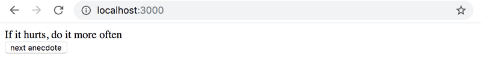
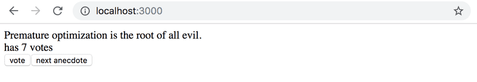
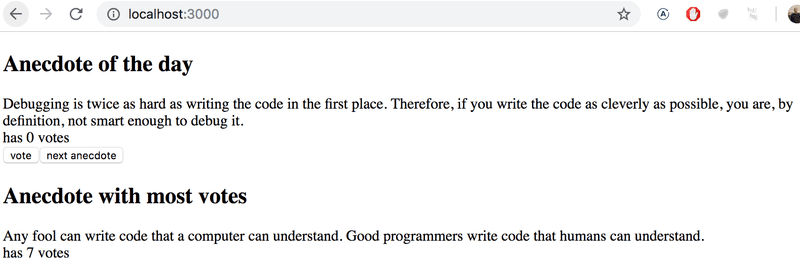

# Full Stack Open

# Part 1: Introduction to React

Part 1 of the course contains exercise 1.1-1.14 and is divided into 3 category: Courseinfo, unicafe and anecdotes.
Here, we are dealing with third category of Part 1 i.e. **anecdotes**  
[Quick link](https://fullstackopen.com/en/part1/a_more_complex_state_debugging_react_apps#exercises-1-6-1-14) to exercise

## 1.12: anecdotes, step1

<details><summary><u><b>TO DO</b></u></summary>

- index.js must be initialized as below:

  ```js
  import { useState } from "react";

  const App = () => {
    const anecdotes = [
      "If it hurts, do it more often.",
      "Adding manpower to a late software project makes it later!",
      "The first 90 percent of the code accounts for the first 10 percent of the development time...The remaining 10 percent of the code accounts for the other 90 percent of the development time.",
      "Any fool can write code that a computer can understand. Good programmers write code that humans can understand.",
      "Premature optimization is the root of all evil.",
      "Debugging is twice as hard as writing the code in the first place. Therefore, if you write the code as cleverly as possible, you are, by definition, not smart enough to debug it.",
      "Programming without an extremely heavy use of console.log is same as if a doctor would refuse to use x-rays or blood tests when diagnosing patients.",
      "The only way to go fast, is to go well.",
    ];

    const [selected, setSelected] = useState(0);

    return <div>{anecdotes[selected]}</div>;
  };

  export default App;
  ```

- Expectd Output:
  

</details>

**<u>My Work summary</u>**  
_smooth_

**<u>Strengthen my understanding</u>**

- If random number is beign generated to trasversal randomly within an array. `Math.floor(Math.random()* Array.prototype.length)` must be used.
- Using `Math.round()` function may try to access the `Array[Array.prototype.length]` which will create problem.

## 1.13: Unicafe, step2

<details><summary><u><b>TO DO</b></u></summary>

- Final output of the application must be:

</details>

**<u>My Work summary</u>**

- Used another useState and copy the 'points' array before updated it with the help of spread operator.

## 1.14: Unicafe, step3

<details><summary><u><b>TO DO</b></u></summary>

- Expected Output:
  

</details>

**<u>My Work summary</u>**

- `Math.max(...arr)` function will return the maximum number within the `arr` array.
- `arr.indexOf(val)` method will return the index of val in the `arr` array.
