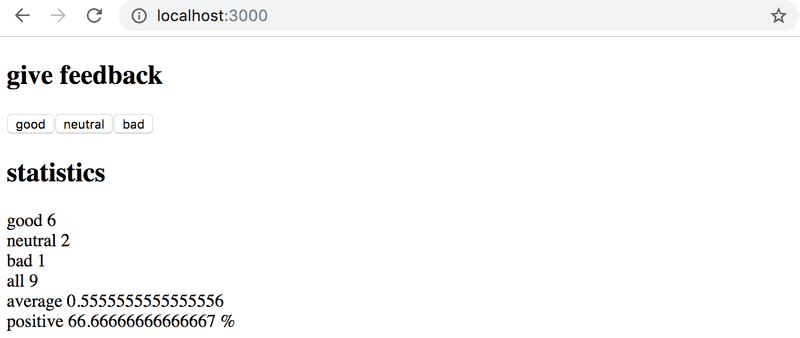
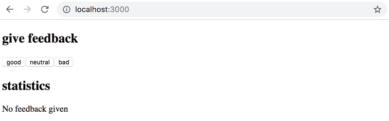

# Full Stack Open

# Part 1: Introduction to React

Part 1 of the course contains exercise 1.1-1.14 and is divided into 3 category: Courseinfo, unicafe and anecdotes.
Here, we are dealing with second category of Part1 i.e. **Unicafe**  
[Quick link](https://fullstackopen.com/en/part1/a_more_complex_state_debugging_react_apps#exercises-1-6-1-14) to exercise

## 1.6: Unicafe, step1

<details><summary><u><b>TO DO</b></u></summary>

- Setup the files and folders as instructed.
- Initialize App.js file as:

  ```js
  import { useState } from "react";

  const App = () => {
    // save clicks of each button to its own state
    const [good, setGood] = useState(0);
    const [neutral, setNeutral] = useState(0);
    const [bad, setBad] = useState(0);

    return <div>code here</div>;
  };

  export default App;
  ```

- Initialize index.js file as:

  ```js
  import React from "react";

  import ReactDOM from "react-dom/client";

  import App from "./App";

  ReactDOM.createRoot(document.getElementById("root")).render(<App />);
  ```

</details>

**<u>My Work summary</u>**

- Create `unicafe` react app with command `npx create-react-app unicafe`
- Delete extra files: (App.css, App.test.js, index.css, logo.svg, setupTests.js, reportWebVitals.js)
- Populate index.js and App.js file as instructed.

**<u>Strengthen my understanding</u>**

> While creating app using `npx create-react-app` git is automatically initialized. Never forget to remove the auto-initialize `.git` directory and `.gitignore` file.

## 1.7: Unicafe, step2

<details><summary><u><b>TO DO</b></u></summary>

- I have to expand my application so that it shows more statistics about the gathered feedback: the total number of collected feedback, the average score (good: 1, neutral: 0, bad: -1) and the percentage of positive feedback.

  

</details>

**<u>My Work summary</u>**

- Completed the work. I have used 4 useState to run the application.
- Created variable is not re-rendered by react. The solution is to use `useState`.

**<u>Strengthen my understanding</u>**

- Paragraph tag is block tag by itself.

## 1.8: Unicafe, step3

<details><summary><u><b>TO DO</b></u></summary>

- Refactor your application so that displaying the statistics is extracted into its own Statistics component. The state of the application should remain in the App root component.

  ```js
  // a proper place to define a component
  const Statistics = (props) => {
    // ...
  }

  const App = () => {
    const [good, setGood] = useState(0)
    const [neutral, setNeutral] = useState(0)
    const [bad, setBad] = useState(0)

    // do not define a component within another component
    const Statistics = (props) => {
      // ...
    }

    return (
      // ...
    )
  }
  ```

</details>

**<u>My Work summary</u>**

- Made new component `Statistics` and passed the function reference only. Function is then called in Statistics component.

**<u>Strengthen my understanding</u>**

- Destructing while passing `props` makes the code easier to understand.

## 1.9: Unicafe, step4

<details><summary><u><b>TO DO</b></u></summary>

- Change your application to display statistics only once feedback has been gathered.

  

</details>

**<u>My Work summary</u>**

- Used [conditional rendering](https://fullstackopen.com/en/part1/a_more_complex_state_debugging_react_apps#conditional-rendering).

**<u>Strengthen my understanding</u>**

- Initial useState value can be treated as variable. I have send them as a property of props

## 1.10: Unicafe, step5

<details><summary><u><b>TO DO</b></u></summary>

- Need to make new component and use the same component to render all statistics.
  ```js
  const Statistics = (props) => {
    /// ...
    return(
      <div>
        <StatisticLine text="good" value ={...} />
        <StatisticLine text="neutral" value ={...} />
        <StatisticLine text="bad" value ={...} />
        // ...
      </div>
    )
  }
  ```

</details>

**<u>My Work summary</u>**

- Created new `statisticsLine` component.
- Passed the function reference from App component to Statistics component. Then Passed the function call to StatisticsLine component.

**<u>Strengthen my understanding</u>**  
_Continued_ learning...

## 1.11: Unicafe, step6

<details><summary><u><b>TO DO</b></u></summary>

- Need to add table element while rendering the statistics.

</details>

**<u>My Work summary</u>**

- Added `table` tag and `tbody` tag within statistics component.

**<u>Strengthen my understanding</u>**

- I tried to rendered the `tr` tag directly into `table` tag. It give following warning:

  `validateDOMNesting(...): <tr> cannot appear as a child of <table>.`  
  The warning was handled by adding `tbody` tag within `table` tag.
